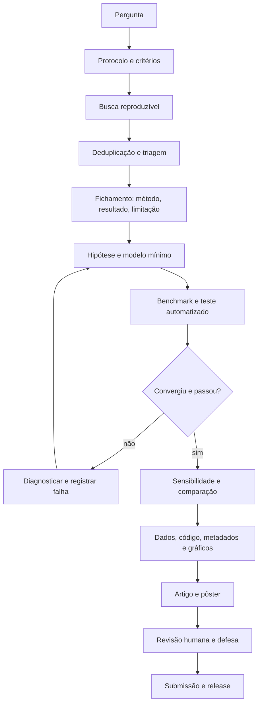

# Protocolo mestre de pesquisa, relato e publicação

## 1. Regra de escopo

Este arquivo é o índice operacional do projeto. Ele integra ABNT, diretrizes de relato, integridade científica, revisão bibliográfica, modelagem computacional, defesa e publicação. O manual da instituição, o programa de pós-graduação, o periódico e a banca podem exigir itens adicionais.

ABNT e ISO brasileiras estabelecem forma e requisitos de apresentação conforme o tipo de documento. PRISMA e EQUATOR são diretrizes de relato e transparência; não substituem desenho científico, revisão por pares, regulamento de defesa ou aprovação ética.

Monografia, dissertação ou tese não precisam ser automaticamente convertidas em artigo ou pôster. Quando a instituição ou o programa exigir publicação ou apresentação, será produzida uma versão derivada com escopo, limites, referências e formato próprios.

## 2. Estrutura documental

| Produto | Estrutura mínima | Critério |
|---|---|---|
| Projeto | tema, problema, pergunta, hipótese, justificativa, objetivos, revisão, método, cronograma, riscos e referências | aprovado pelo responsável institucional |
| Artigo | título, autoria, resumo, palavras-chave, introdução, método, resultados, discussão, conclusão, declarações e referências | periódico e ABNT/instrução editorial conferidos |
| Monografia/dissertação/tese | elementos pré-textuais, introdução, revisão, método, resultados, discussão, conclusão, referências e pós-textuais | manual institucional e banca |
| Pôster/banner | título, autores, contexto, pergunta, método, resultado, conclusão, limitações, QR/URL e referências essenciais | legível à distância e coerente com o artigo |
| Código/dados | fonte, ambiente, entradas, testes, logs, metadados, licença e artefatos | terceiro reproduz ou entende a falha |

## 3. Metodologia da revisão

### 3.1 Pergunta e protocolo

Definir pergunta, população ou sistema, fenômeno, comparação, desfecho, período, idiomas, bases e critérios antes da seleção. Para este projeto, a revisão é inicialmente de escopo, porque mapeia literatura heterogênea sobre carbono, DFT, HPHT/CVD, betavoltaica e segurança.

### 3.2 Busca

Registrar base, URL, data, consulta literal, filtros, exportação, deduplicação e alterações. PRISMA-S deve orientar o relato da estratégia de busca.

### 3.3 Seleção

Registrar identificados, duplicados, triados, texto completo avaliado, incluídos e excluídos com motivo. O fluxograma deve ser atualizado junto com a planilha.

### 3.4 Fichamento

Cada estudo incluído deve conter: identificação, pergunta, sistema/amostra, método, resultado, limitação, risco de viés ou incerteza, DOI/URL e uso previsto.

### 3.5 Síntese

Separar resultados por tema e método. Não combinar numericamente resultados incompatíveis. Explicitar heterogeneidade, ausência de dados, conflitos e certeza da evidência.

## 4. Metodologia computacional

1. Definir hipótese e métrica.
2. Escolher o menor modelo capaz de testá-la.
3. Fixar geometria, composição, carga, multiplicidade, base, funcional, condições de contorno, tolerâncias, versão e hardware.
4. Executar benchmark e teste negativo.
5. Verificar convergência, unidades, invariantes e sensibilidade.
6. Comparar métodos e literatura.
7. Gerar JSON, CSV, gráfico, log e metadados.
8. Interpretar sem extrapolar de molécula pequena para material periódico.
9. Registrar falhas e mudanças.
10. Publicar artefatos associados ao commit.

## 5. Fluxograma

## 6. Checklist CNPq e integridade

- [ ] autoria definida por contribuição real;
- [ ] conflitos e financiamento declarados;
- [ ] IA, ferramenta, versão, finalidade e etapa declarados;
- [ ] responsabilidade humana pelo conteúdo final;
- [ ] dados, metadados, código e protocolos preservados;
- [ ] alterações de método e dados justificadas;
- [ ] resultados negativos mantidos;
- [ ] citações conferidas e paráfrases autorais;
- [ ] riscos, ética e segurança avaliados;
- [ ] periódico não predatório e adequado ao escopo;
- [ ] versão submetida, pareceres e respostas arquivados.

## 7. Checklist PRISMA/EQUATOR

- [ ] tipo de revisão identificado;
- [ ] pergunta e racional explícitos;
- [ ] bases, datas e estratégias completas;
- [ ] critérios de elegibilidade definidos;
- [ ] processo de triagem e extração descrito;
- [ ] fluxograma e tabela de estudos disponíveis;
- [ ] limitações da busca e da síntese declaradas;
- [ ] diretriz de relato adequada identificada;
- [ ] localização dos itens da checklist registrada no manuscrito.

## 8. Artigo, apresentação e defesa

O artigo deve responder uma pergunta principal. O pôster deve resumir o mesmo estudo sem introduzir conclusão nova. A defesa deve apresentar problema, lacuna, método, evidência, limite e contribuição; respostas que não possam ser sustentadas devem ser classificadas como hipótese ou trabalho futuro.

## 9. Publicação do projeto

Uma release só pode ser criada quando artigo, pôster, código, dados, metadados, referências, logs e limitações estiverem associados ao mesmo commit ou execução. O pacote atual é benchmark molecular não radioativo e não pode ser descrito como demonstração de diamante, bateria ou material radioativo.
